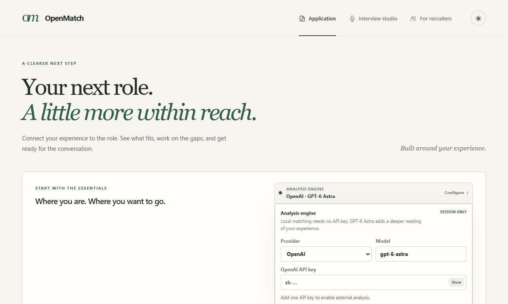
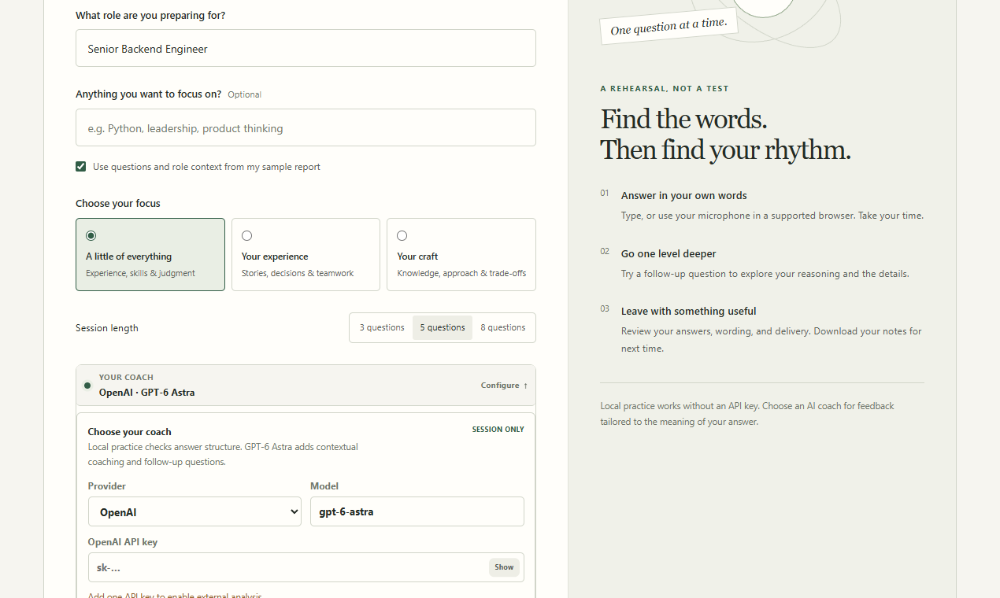
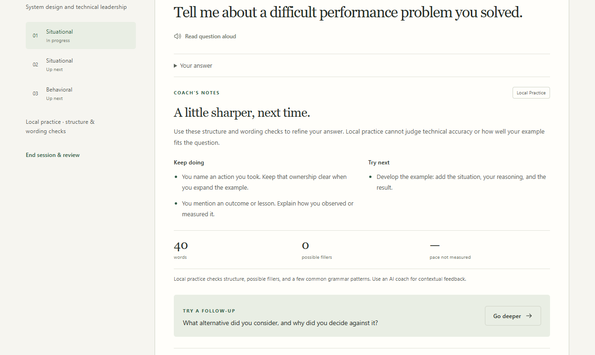

# OpenMatch

OpenMatch compares resumes against a job description and shows the evidence behind the match instead of returning a black-box score.

It supports three workflows:

- **Applicant:** analyze one resume, review matched and missing requirements, improve resume wording, and prepare for interviews.
- **Recruiter:** compare multiple resumes against the same role, rank candidates using the same criteria, and review feedback drafts before sending anything.
- **Interview studio:** rehearse a role with typed or spoken answers, follow-up questions, coaching notes, and an exportable recap. Start directly or use questions from your application report.

The backend can run entirely in local deterministic mode. GPT-6 Astra and Gemini are optional.

## GPT-6 Astra Challenge

OpenMatch's OpenAI path is built for the GPT-6 Astra Challenge. Choose **OpenAI**
under **Analysis engine** or **Your coach**, enter an API key for the current
session, and the app sends structured requests to `gpt-6-astra` through the
Responses API. Astra powers the deeper resume-to-role analysis and the interview
studio's contextual questions, follow-ups, and answer feedback. The key is never
persisted by the browser or backend.

The local engine remains available so anyone can explore the full interface and
evidence-first workflow without an API key. It is clearly labeled and never
presented as an Astra result.

## Product tour

### Evidence-first application workspace



### GPT-6 Astra interview studio



### Answer feedback and coaching recap



## Stack

- React + Vite
- FastAPI
- Pydantic
- LangChain + FAISS for optional RAG analysis
- `pypdf` for resume text extraction

## Run locally

Clone the repository, then start the backend and frontend in separate terminals.

### Backend

```bash
cd backend
python -m venv .venv
```

Activate the environment:

```bash
# Windows PowerShell
.\.venv\Scripts\Activate.ps1

# macOS/Linux
source .venv/bin/activate
```

Install dependencies and start the API:

```bash
pip install -r requirements.txt
python -m uvicorn app.main:app --reload --host 127.0.0.1 --port 8000
```

API: `http://127.0.0.1:8000`  
Docs: `http://127.0.0.1:8000/docs`

No API key is required for local analysis. For OpenAI, Gemini, or SMTP configuration, copy `backend/.env.example` to `backend/.env` and fill in the values you need.

### Frontend

```bash
cd frontend
npm install
npm run dev
```

Open `http://127.0.0.1:5173`.

The **Explore sample** flow can be used without the backend or an API key.

The **Interview studio** needs the backend. Local practice needs no API key;
GPT-6 Astra and Gemini coaching use the provider selected in **Your coach**.
Choose a suggested model or enter a compatible provider model ID. Keys stay
in memory for the current session.

Voice input uses the browser's English speech recognition where supported.
It requires microphone permission and localhost or HTTPS; some browsers send
audio to their speech service. Typing works in every browser. Local feedback
checks structure and a few wording patterns; contextual feedback needs an AI
provider. Sessions stay in memory, so download notes before refreshing.

## Checks

Backend tests:

```bash
cd backend
python -m unittest discover -s tests
```

Frontend checks:

```bash
cd frontend
npm run lint
npm run build
```

Browser workflow checks (Chrome installed, plus backend dependencies):

```bash
cd frontend
npm run test:e2e
```

The test runner starts the frontend and backend or reuses running development
servers. Set `OPENMATCH_PYTHON` to your virtual environment's Python executable
if needed. `PLAYWRIGHT_CHANNEL` selects another installed Chromium browser.
Speech recognition is simulated in these tests; no microphone access or paid
AI calls are required.

## Notes

- Job descriptions can be pasted directly or extracted from supported public job pages.
- Recruiter email delivery is disabled by default and requires explicit review before sending.
- AI providers return the same application response shape as local analysis.
- The OpenAI selector defaults to `gpt-6-astra`; custom compatible model IDs remain supported.

Implementation details, provider behavior, ingestion safeguards, and production work are documented in [PRODUCT.md](./PRODUCT.md).
