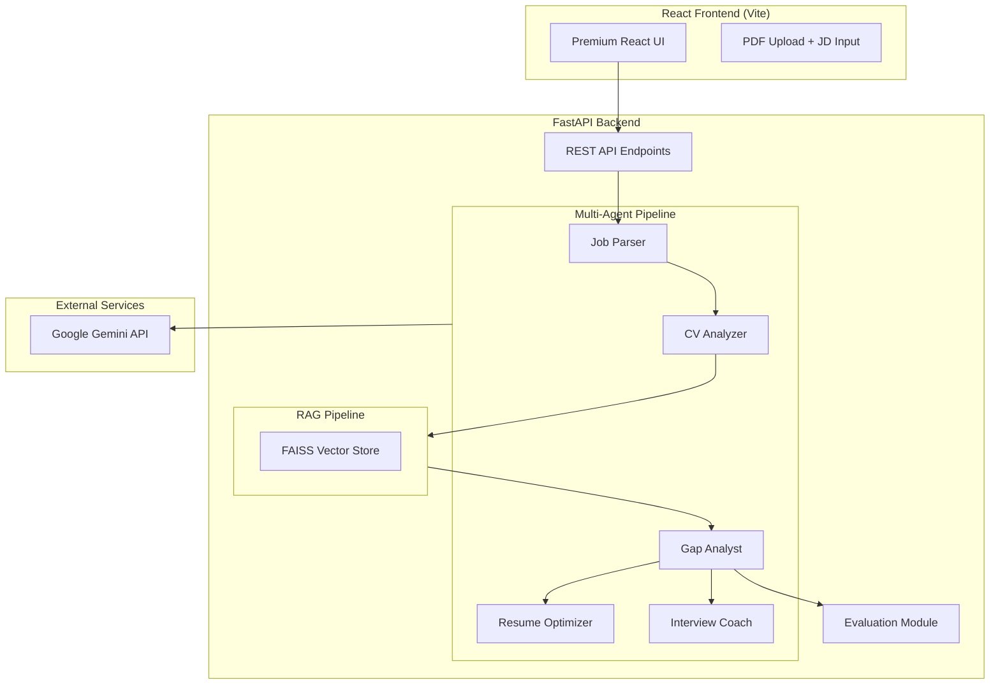

# 🎯 AI-Powered Job Application Assistant


An end-to-end resume-to-job-description assistant. Upload a CV, paste a job
description, and receive a match score, evidence-backed skill gaps, resume
improvements, and interview preparation.

The MVP works without an API key using a private, deterministic local analyzer.
When a Gemini key is configured, it automatically enables the deeper multi-agent
RAG pipeline.

## 🌟 Key Features

*   **Multi-Agent Architecture**: 5 specialized AI agents (Job Parser, CV Analyzer, Gap Analyst, Resume Optimizer, Interview Coach) using LangChain.
*   **Structured Output**: Uses Pydantic models for highly reliable, structured LLM extraction.
*   **RAG Pipeline**: Semantic search using FAISS and Gemini Embeddings to retrieve exact CV evidence for skill matching.
*   **Resume Optimization**: Before/After diffs for resume bullet points, ATS keyword suggestions, and tailored professional summaries.
*   **Interview Prep**: Generates behavioral and technical questions with suggested answers using the STAR method based on *your actual experience*.
*   **Premium React UI**: Dark-mode-first aesthetic with smooth animations and comprehensive dashboards.
*   **Evaluation Module**: Built-in LLM-as-judge scoring to ensure the relevance and quality of recommendations.

## 🏗️ Architecture



## 🚀 Quick Start (Local Development)

### Prerequisites

*   Python 3.12+
*   Node.js 20+
*   A Google Gemini API Key is optional

### 1. Setup Backend

```bash
cd backend
python -m venv venv
source venv/bin/activate  # Or `venv\Scripts\activate` on Windows
pip install -r requirements.txt

# Optional: copy .env.example to .env and add a Gemini key for AI mode.
# Without a key, ANALYSIS_MODE=auto uses the local MVP analyzer.

# Run FastAPI server
uvicorn app.main:app --reload --port 8000
```

### 2. Setup Frontend

```bash
cd frontend
npm install

# Run Vite dev server
npm run dev
```

Visit `http://localhost:5173` in your browser.

### Analysis modes

Set `ANALYSIS_MODE` in `backend/.env`:

* `auto` (default): use Gemini when a key exists, otherwise run locally
* `local`: always use the zero-configuration deterministic analyzer
* `ai`: require `GOOGLE_API_KEY` and use the multi-agent RAG pipeline

The local MVP performs transparent skill/evidence matching and is intentionally
conservative. It does not store the uploaded CV.

## 🐳 Docker Deployment

You can run the entire stack using Docker Compose:

```bash
# Build and run
docker-compose up --build
```

To enable AI mode in Docker, set `GOOGLE_API_KEY` before starting the stack.

The frontend will be available at `http://localhost:5173` and the backend API at `http://localhost:8000`.

## 💼 For Recruiters: STAR Method Breakdown

### S (Situation)
Job seekers struggle to tailor their applications effectively. Most submit generic resumes, missing critical keyword alignment and skill gap awareness.

### T (Task)
Built an AI-powered application assistant that automates resume-to-job-description alignment using a multi-agent RAG architecture.

### A (Action)
*   Designed a multi-agent pipeline (LangChain) with specialized agents for job parsing, CV analysis, gap identification, resume optimization, and interview preparation.
*   Implemented RAG with FAISS vector store and custom chunking strategies for CV/job description embedding.
*   Built structured output generation using Pydantic schemas for consistent, actionable results.
*   Developed evaluation metrics (retrieval precision, LLM-as-judge) to measure recommendation quality.
*   Built a premium, interactive frontend using React and Vite.

### R (Result)
*   Provides accurate skill gap identification with verifiable CV evidence.
*   Generates tailored resume bullet points that increase keyword match.
*   Provides role-specific interview Q&A with evidence-based suggested answers using the candidate's actual experience.
